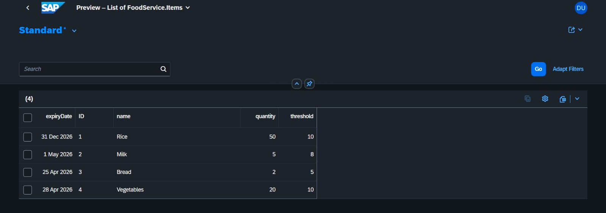
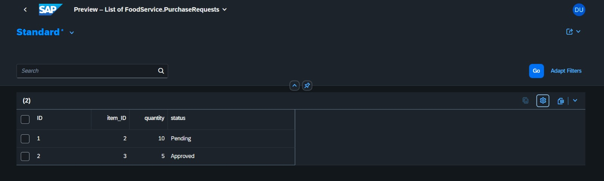
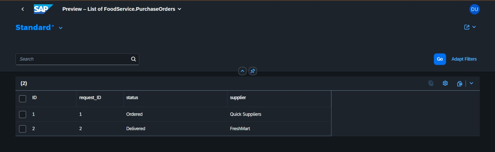
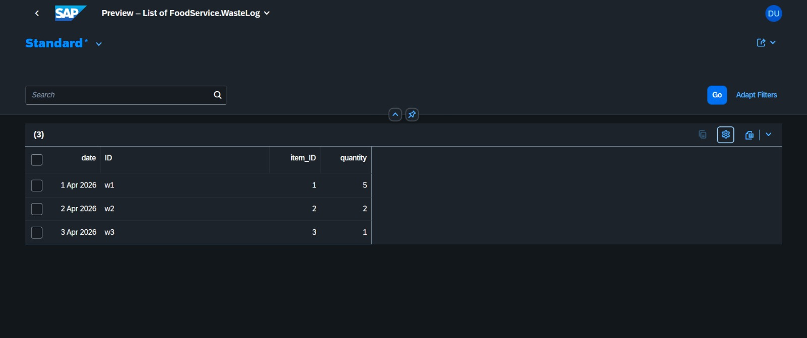

#  Smart Food Procurement System (FoodP2P)

## Project Overview

FoodP2P is a Smart Procurement System built using **SAP CAP (Cloud Application Programming Model)**.
It simulates a simplified **Procure-to-Pay (P2P) cycle** for food inventory management.

The system helps track inventory, manage purchase requests and orders, and reduce food wastage.

## Objectives

* Track food inventory efficiently
* Detect low stock automatically
* Manage purchase requests and orders
* Reduce food wastage using waste tracking

## Technology Stack

* SAP CAP (Node.js)
* SQLite (In-memory DB)
* SAP Business Application Studio
* OData V4 Services

## System Architecture

* **Database Layer** → Stores items, requests, orders, waste logs
* **Service Layer** → Exposes APIs
* **Application Layer** → Handles business logic

## Procure-to-Pay Flow

Items → Purchase Request → Purchase Order → Supplier

## Entities

### Items

* ID
* Name
* Quantity
* Expiry Date
* Threshold

### Purchase Requests

* ID
* Item ID
* Quantity
* Status

### Purchase Orders

* ID
* Request ID
* Supplier
* Status

### Waste Log

* ID
* Item ID
* Quantity
* Date

## Data Storage

Data is stored using CSV files:

* food-Items.csv
* food-PurchaseRequests.csv
* food-PurchaseOrders.csv
* food-WasteLog.csv

## OData Services

* `/odata/v4/food/Items`
* `/odata/v4/food/PurchaseRequests`
* `/odata/v4/food/PurchaseOrders`
* `/odata/v4/food/WasteLog`

## Features

* Inventory tracking
* Low stock detection
* Procurement simulation
* Waste monitoring

## 📸 Screenshots

### Items

### Purchase Requests

### Purchase Orders

### Waste Log

## Advantages

* Reduces manual effort
* Improves efficiency
* Prevents shortages
* Tracks wastage

## Future Scope

* AI-based demand prediction
* Real-time SAP integration
* Dashboard UI
* Smart alerts

## Author

**Asmi Dutta**

